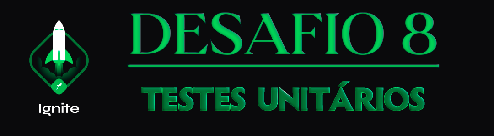

  

<h1 align="center"> RocketSeat 🚀 Ignite NodeJS 🌠</h1>

  
  
  
  

## 🧠 Detalhes do desafio

Nesse desafio, você deverá criar testes unitários para uma aplicação já pronta usando tudo que aprendeu até agora sobre testes.

Para que você possa focar somente na parte de testes unitários sem precisar estudar muito a aplicação do zero, o template foi desenvolvido com base em uma aplicação já conhecida: **FinAPI**. A API construída no primeiro módulo da trilha.

  

Feito com ❤️ por [Augusto Hermes](https://github.com/augustohermes) 👋.
